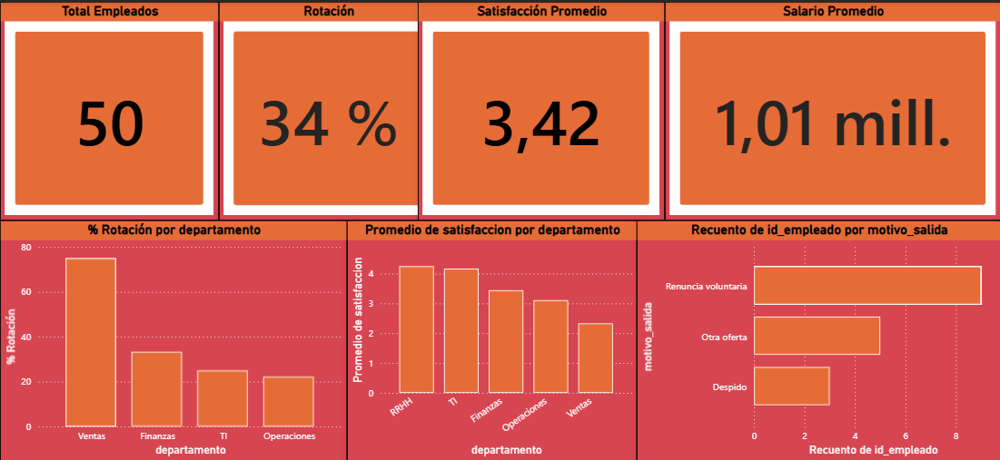

# Análisis de Rotación de Personal — SQL + Python + Power BI

## Contexto de negocio
Empresa de 50 empleados necesita entender por qué está perdiendo talento.
Este proyecto integra SQL, Python y Power BI para identificar patrones de
rotación y proponer acciones de retención basadas en datos.

## Flujo del proyecto

CSV → SQL (extracción) → Python (limpieza + EDA) → Power BI (dashboard)

## Hallazgos principales
- Tasa de rotación general: **34%** — crítica en Ventas (75%)
- El **82%** de las salidas son evitables (renuncia voluntaria + otra oferta)
- Correlación satisfacción-rotación: **-0.86** (muy fuerte)
- Correlación horas extra-rotación: **+0.80** (muy fuerte)
- A mayor horas extra, menor satisfacción, mayor rotación

## KPIs del dashboard
| Métrica | Resultado |
|---------|-----------|
| Total empleados | 50 |
| Tasa de rotación | 34% |
| Satisfacción promedio | 3.42 / 5 |
| Salario promedio | $1.01M CLP |

## Técnicas utilizadas

### SQL
- Tasa de rotación por departamento
- Motivos de desvinculación con porcentajes
- Salario, satisfacción y horas extra por departamento

### Python
- Limpieza de datos y cálculo de antigüedad con Pandas
- Análisis de correlaciones entre variables
- Visualizaciones con Matplotlib y Seaborn

### Power BI
- Dashboard ejecutivo con tarjetas KPI
- Medidas DAX personalizadas
- Filtros dinámicos por departamento

## Stack

## Archivos
- `rrhh_sample.csv` — dataset de 50 empleados
- `analisis_rrhh.ipynb` — notebook Python con EDA completo
- `analisis_rrhh.png` — gráficos del análisis exploratorio
- `rrhh_dashboard.pbix` — dashboard Power BI

## Cómo usar
1. Importa `rrhh_sample.csv` en DB Browser → tabla `empleados`
2. Ejecuta los queries SQL del notebook
3. Abre `analisis_rrhh.ipynb` en Jupyter
4. Abre `rrhh_dashboard.pbix` en Power BI Desktop
